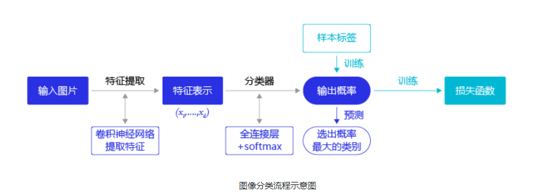
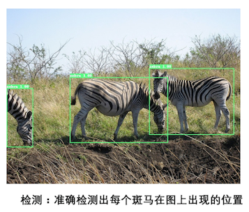
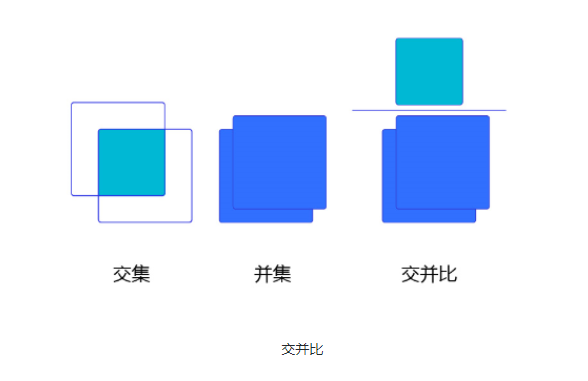
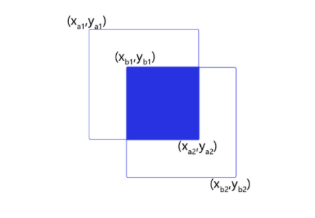
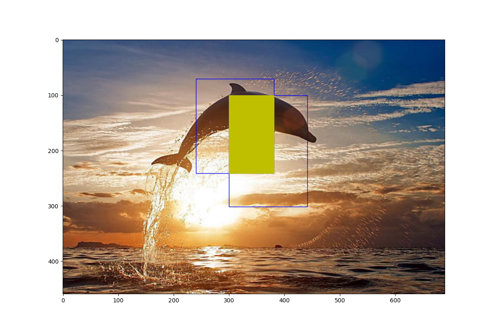

# 目标检测的需求

图像分类识别的成功之后，人们开始不满足于仅对图像中的物体进行识别，而希望对图像中的具体物体进行精确的定位与分类——这就是**目标检测**任务。

通常而言，检测算法可以分为两种：

* 二阶段检测算法：**RCNN**系列
* 一阶段检测算法：**SSD,YOLO**系列等

其中，二阶段检测算法检测精度高，耗时长；一阶段检测算法精度略低，耗时短。

# 目标检测的主要部件

## 1. 边界框 & 锚框

**边界框**：就是定义**物体实际位置**的一个概念——通常为矩形框，有时也可以取多边形框。

**边界框的表示方式**：

* 一种：以 $xyxy$ 表示，即边界框的左上顶点 $(x_{1}, y_{1})$ ，右下顶点 $(x_{2}, y_{2})$ ：
  * 上图中，最后边的边界框就可以表示为: $(247.2,131.62,480.0,639.32)$ 
* 另一种：以 $xywh$ 表示，即边界框的中心点与边界框的长(高)宽:
  * $(x, y, w, h)$ , $w$ 是边界框的宽， $h$ 是边界框的长(高)

 **锚框**： 一种假象的框，提前人为设定——通常在每个像素中心点绘制一定数量的不同长宽比的锚框。（**不是真实框，是预测多需要的一种预置框**）

在清楚了**边界框 & 锚框**的表示之后，可以尝试着用代码来进行绘制，感受一下两种方式的边界框的**具体代码操作**！

1. **bounding box**的数据表示以及**演示代码**已完成：边界框演示代码\bounding_box_show.py
2. **anchor box** 的数据表示以及**演示代码**已完成：边界框演示代码\anchor_box_show.py

**PS：**

* 边界框通常指的就是实际标注数据中的**真实边界框**！
* 模型预测对真实边界框进行调整后输出的是**预测框**！（不要搞混了）
* **边界框==真实框**，**预测框！=边界框！**

## 2. 交并比IoU

**IoU**: 简单来说，就是锚框与真实框的交集与锚框与真实框的并集之比。
$$
IoU = \frac{A∩B}{A∪B}
$$
其中：

* A 是真实框
* B 是预测框——也就是锚框

形象的表示为:

如何确定A,B之间的交集呢？

首先，假设A，B的bbox数据：
$$
A = [x_{a1}, y_{a1}, x_{a2}, y_{a2}] \\
B = [x_{b1}, y_{b1}, x_{b2}, y_{b2}] \\
$$
而此时的交集情况:

因此，交集的左上角坐标就是A,B的左上角x，y的最大值:【以x向右为正，y向下为正，均从0开始】
$$
inter_{x1} = max(x_{a1}, x_{b1}) \\
inter_{y1} = max(y_{a1}, y_{b1}) \\
$$
而右下角的顶点则是A,B的右下角最小值：
$$
inter_{x2} = min(x_{a2}, x_{b2}) \\
inter_{y2} = min(y_{a2}, y_{a2}) \\
$$
此时，交集的长宽就可以得到了:【长度由具体的像素个数决定，因此需要加1】
$$
inter_{w} = max(inter_{x2} - inter_{x1} + 1.0, 0.)\\
inter_{h} = max(inter_{y2} - inter_{y1} + 1.0, 0.)\\
$$
因此，交集面积:
$$
S_{inter} = inter_{w} * inter_{h} \\
$$
最后我们计算一下并集的面积:

A, B框的面积：
$$
S_{A} = (x_{a2} - x_{a1} + 1.0) * (y_{a2} - y_{a1} + 1.0) \\
S_{B} = (x_{b2} - x_{b1} + 1.0) * (y_{b2} - y_{b1} + 1.0) \\
$$
并集面积:
$$
union_area = S_{A} + S_{B} - S_{inter}
$$
此时的交并集IoU：
$$
IoU = \frac{S_{inter}}{union_area} = \frac{S_{inter}}{S_{A} + S_{B} - S_{inter}}
$$

示例：【黄色区域就是交集面积】

**IoU计算实践代码**:

* 边界框演示代码\IoU_sovle.py

## 3. 总结

1. bbox坐标与长宽的转换技巧：

   1. 如果bbox的形式为x1y1x2y2，需要求center_x, center_y , w, h的数据，那么在求w，h时，需要注意对应坐标值的差值+1.
      $$
      w = x2 - x1 + 1.0 \\
      h = y2 - y1 + 1.0\\
      $$
      之所以如此，是因为，坐标值从0开始，而长度由像素个数决定，两个坐标值之差得到的值实际上比实际像素个数少一个，所以要加1.

   2. 如果bbox形式为xywh，需要求边框的x1y1x2y2的数据，那么你要清楚此时的边框是否需要考虑边界问题：
      $$
      x1 = x - \frac{w}{2.0} \\
      y1 = y - \frac{h}{2.0} \\
      x2 = x + \frac{w}{2.0} \\
      y2 = y + \frac{h}{2.0} \\
      $$
      上边的形式就是不考虑边界时，即边框转换后仍然在图片区域内；

      那么，如果考虑边界是什么样子的呢？

      * $x1 = max(x - \frac{w}{2.0}, 0.)$ 考虑是否超过左边界，所以最多可以为0点
      * $y1 = min(y - \frac{h}{2.0}, 0.)$
      * $x2 = max(x + \frac{w}{2.0} - 1.0, img_{width} - 1.0)$ 考虑右边界，所以最多可以为$img_{width} - 1.0$ ， 这里之所以减去1，与技巧一加1是对称关系。
      * $y2 = min(y + \frac{h}{2.0} - 1.0, img_{height} - 1.0)$

2.  清楚了bounding box，anchor box, IoU的含义，以及表示，以及必要的代码练习，可以对目标检测有更清楚的理解。

